# Задания по программированию
Задания предполагают реализацию на языке Python 3.14. Для выполнения заданий рекомендуется использовать IDE Visual Studio Code.

Задания размещены в отдельных ветках репозитория, название которых начинается с префикса main, например, ветка main-task-0.

В файле README.md в ветке задания расположена информация, необходимая для его выполнения.

## С чего начать

Перед выполнением первого задания настройте рабочее место согласно инструкции [Установка необходимого ПО](Установка%20необходимого%20ПО.md): учётная запись GitHub, Git, Python 3.14, VS Code и клонирование репозитория с программными заданиями.

В клонированном репозитории создайте виртуальное окружение (каталог `.venv`) и установите зависимости командой `pip install -r requirements.txt`. Решения в основную ветку `main` не коммитят — только в отдельную ветку задания. Каталог `.venv` в репозиторий добавлять не нужно.

## Выполнение заданий

**Для выполнения конкретного задания необходимо создать отдельную ветку** на основе ветки с заданием, назвать новую ветку в соответствии с веткой задания, заменив префикс main на название команды, например first-team-task-0.

Предварительно необходимо получить с сервера ветку с заданием, для этого можно использовать команду `git fetch origin` или воспользоваться вкладкой Source Control на боковой панели IDE

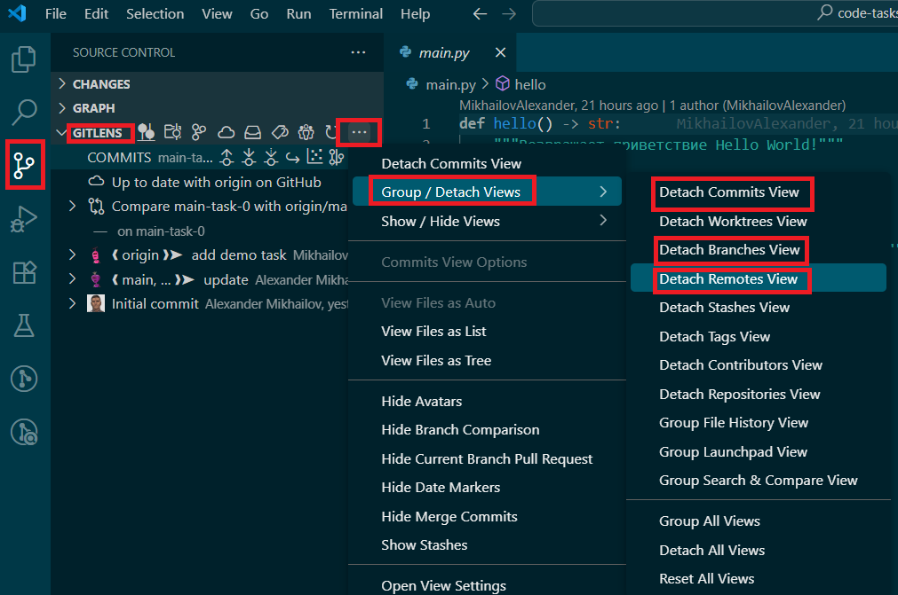

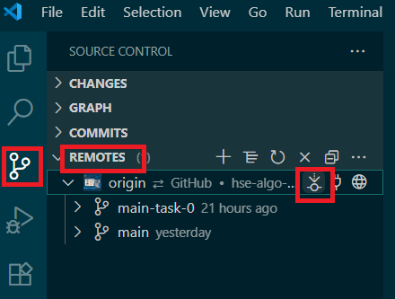

На основе ветки с заданием нужно создать ветку для решения

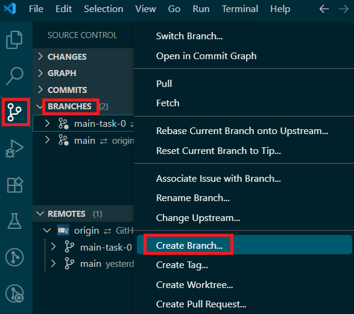

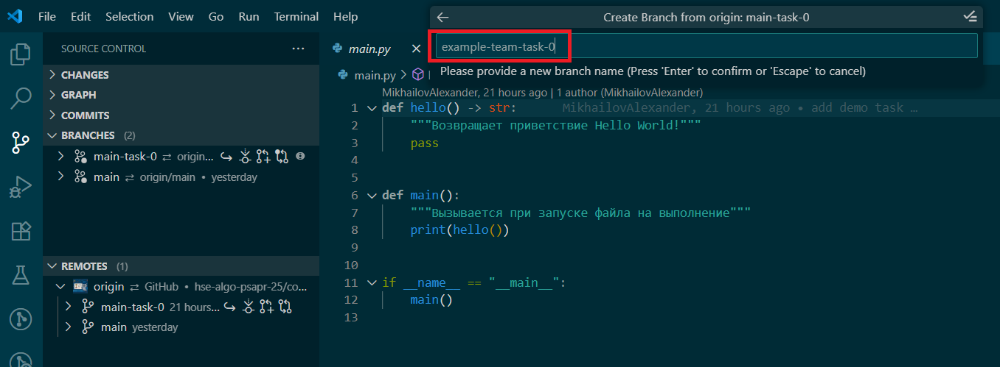

Как правило, для выполнения задания необходимо реализовать предложенные функции в файле main.py. В файлах с префиксом test расположены модульные тесты для проверки правильности реализации функций. Если необходимо реализовать несколько функций, например fibonacci и determinant, то в ветке будут соответствующие файлы с модульными тестами test_fibonacci.py и test_determinant.py, а также файл test_runner.py, объединяющий тесты из отдельных файлов. Провести тестирование можно путем запуска на выполнение файлов с модульными тестами или файла test_runner.py. 

Рекомендуется настроить тесты на вкладке Testing левой панели

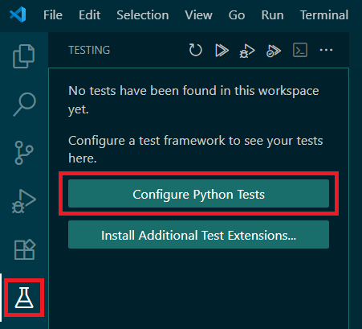

Нажать кнопку Configure Python Tests после чего выбрать фреймворк unittest

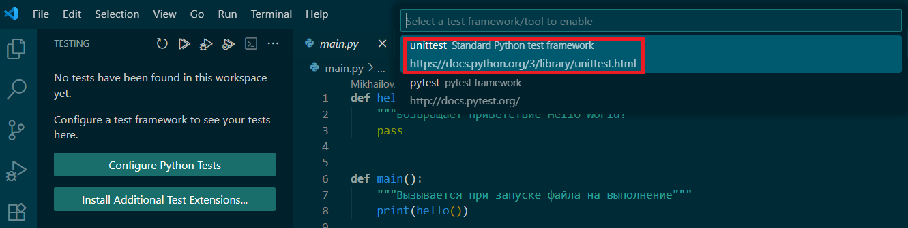

В качестве корневой директории проекта выбрать корень репозитория 

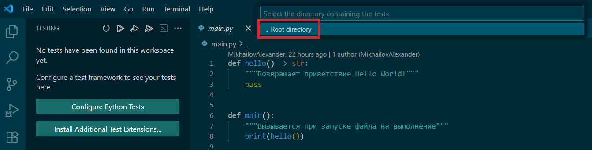

Шаблон имени файла для поиска тестов *test*.py

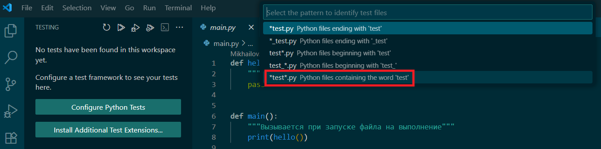

Затем необходимо перезагрузить IDE.

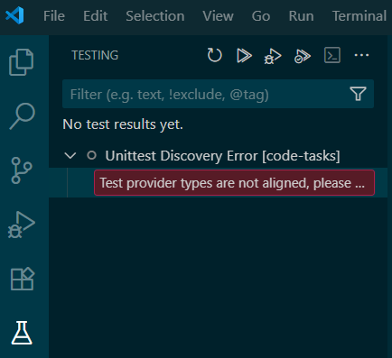

После чего тесты будут доступны для просмотра и запуска в боковой панели

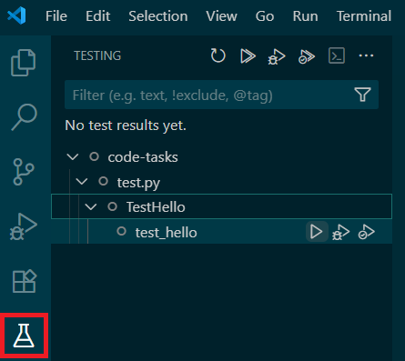

После выполнения задания и прохождения тестов можно с помощью команд в терминале:
- Запустить автоматическую сортировку импортов в исходном коде `python -m isort .`
- Запустить автоматическое форматирование исходного кода `python -m black .`
- Запустить проверку синтаксиса и форматирования `python -m flake8 . --max-complexity=10 --max-line-length=88 --exclude .venv`.

Эта команда `flake8` должна завершиться без ошибок: она падает и на синтаксисе, и на стиле (длина строки, сложность, оформление). На вкладке Checks в pull request стиль **не валит** сборку: там flake8 останавливает проверку только при синтаксических ошибках и неопределённых именах, замечания по стилю идут с `--exit-zero`. Зелёные Checks не означают, что оформление принято — на ревью смотрят и стиль. Приведите код к виду, который проходит локальный `flake8` выше.

## Результат выполнения задания - pull request
После реализации предложенных функций, прохождения всех модульных тестов, проверки синтаксиса и оформления кода, необходимо зафиксировать изменения (git commit) и отправить их в репозиторий на GitHub (git push). Это можно сделать на вкладке Source Control, добавив через + нужный файл и написав сообщение коммита

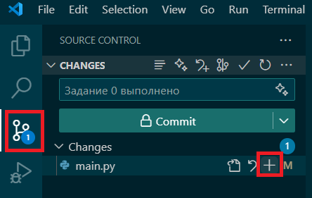

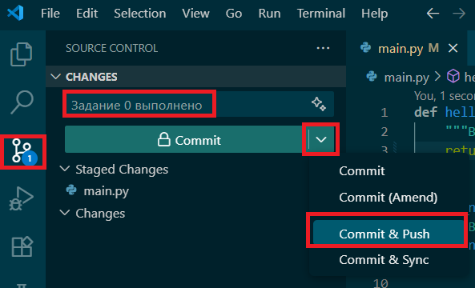

При первом коммите Git может попросить заполнить данные пользователя в конфигурации

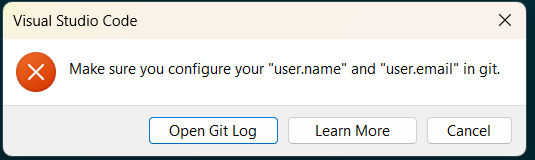

Можно задать имя и почту глобально с помощью команд:

```sh
git config --global user.email "you@example.com"
git config --global user.name "Your Name"
```

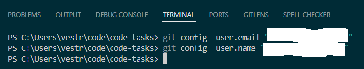

или локально, только для текущего репозитория, убрав из команд опцию --global. Эти данные используются для метаданных коммитов.

Если текущей ветки нет на сервере GitHub будет выведено соответствующее предупреждение, с которым нужно согласиться.

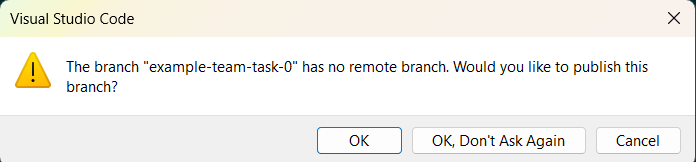

После фиксации и отправки изменений необходимо создать на GitHub pull request (запрос на включение изменений) **в ветку задания**, не в `main`. На GitHub это называется merge / «слияние», но в этом репозитории предложенный код **не вливают** в `main-task-*`: ветки заданий защищены, после ревью преподавателем и выставления оценки запрос закрывается без вливания (merge). Решение остаётся в ветке команды.

Важно не ошибиться с выбором веток для запроса: в base указать ветку задания, например main-task-0, а в compare — собственную ветку с выполненным заданием, например first-team-task-0. В заголовке запроса можно указать название своей ветки, для удобного просмотра списка запросов. В описании запроса можно указать роли участников команды, выполнявших задание, или добавить информацию, если это явно указано в задании.

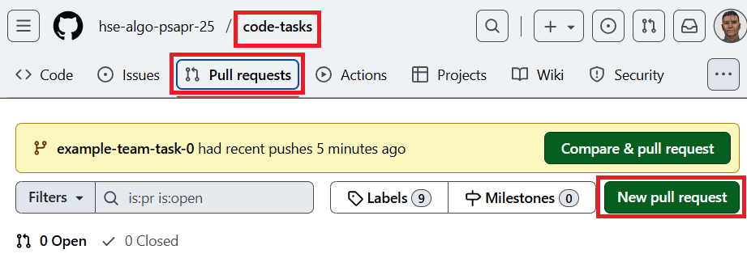

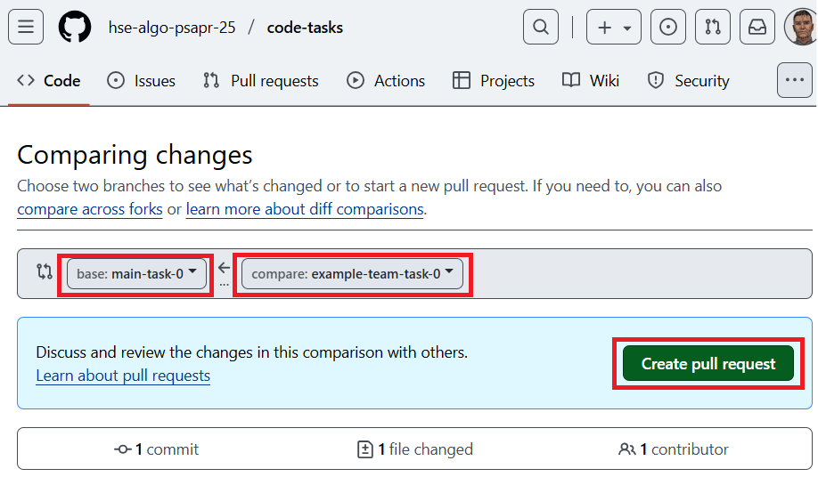

После создания pull request производится автоматический запуск тестов, ход выполнения и результаты можно посмотреть на вкладке Checks. 

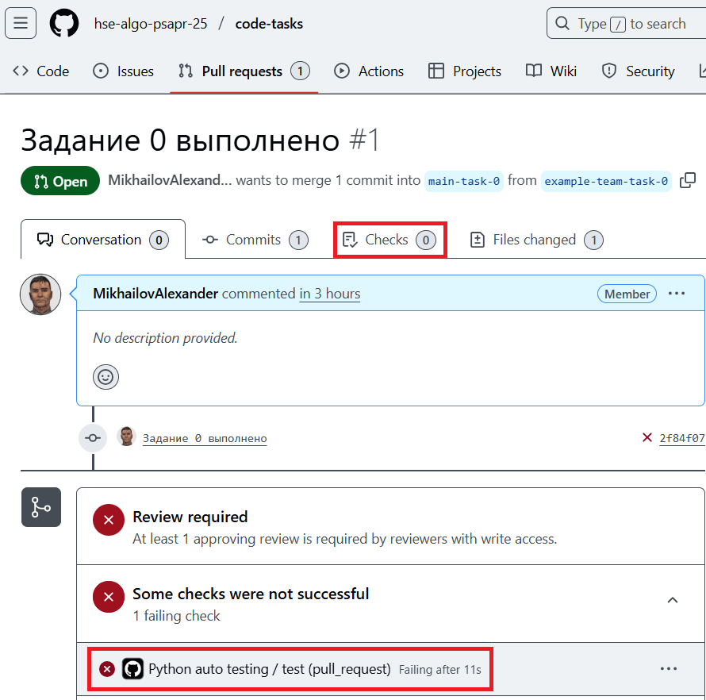

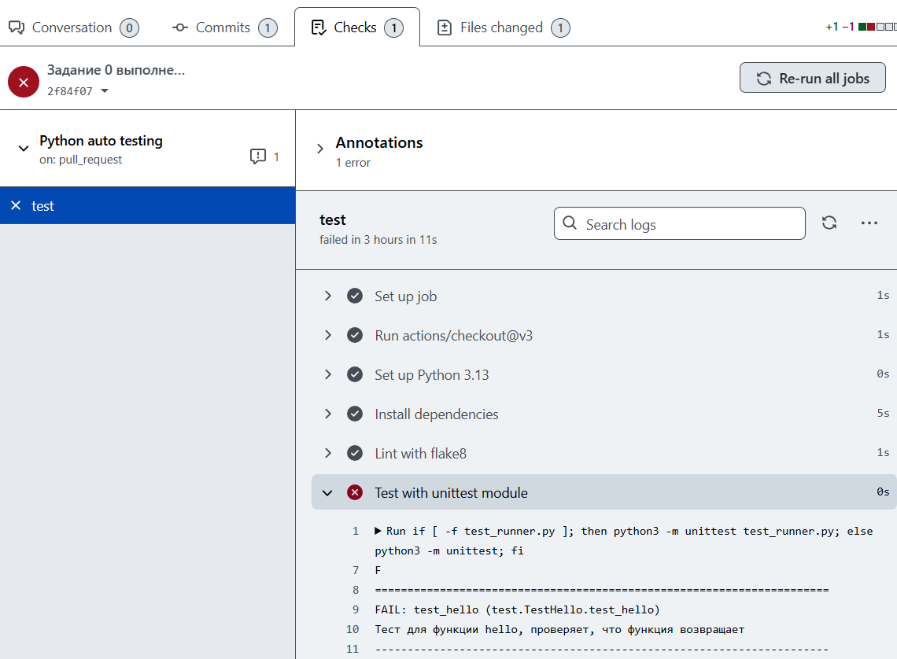

Если выполнение тестов выявило ошибки, следует исправить их, снова зафиксировать и отправить изменения на GitHub: они автоматически появятся в том же pull request (**новый запрос создавать не нужно**). На вкладке Files changed видны изменения в файлах по сравнению с целевой веткой. На вкладке Conversation ведётся обсуждение выполненного задания. Если автоматическое тестирование не выявило ошибок, преподаватель проведёт ревью кода и подтвердит его либо оставит вопросы или замечания. Зелёные Checks сами по себе не закрывают задание: ревью смотрит реализацию и оформление (локальный `flake8` выше). После подтверждения задание будет оценено, pull request **будет закрыт без слияния** с веткой `main-task-*`.