# Для прохождения курса рекомендуется настроить:

## GitHub account
Создать учетную запись на сервисе GitHub и отправить ее преподавателю для добавления в GitHub-организацию для выполнения заданий курса.

## Git
Установить Git, если он еще не установлен. Установщик для Windows можно скачать с официального сайта https://git-scm.com/downloads/win

## Python 3.14
Установить Python в версии 3.14, если он еще не установлен. Если установлен Python в другой версии, установите дополнительно 3.14. Установщик для Windows можно скачать с [официального сайта](https://www.python.org/ftp/python/3.14.7/python-3.14.7-amd64.exe)

**Важно!** При установке необходимо добавить путь до Python в переменные окружения.

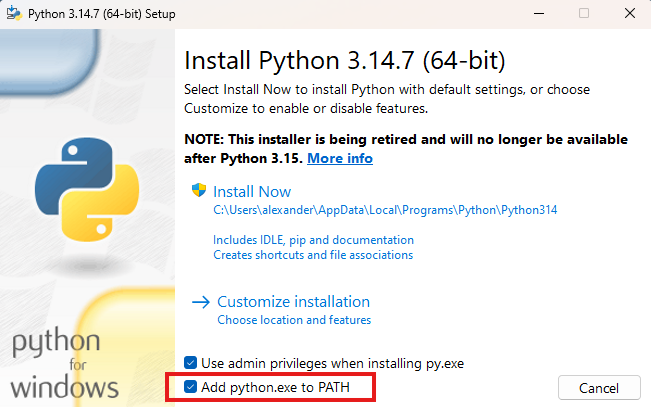

Проверьте, что установщик сработал: в **новом** терминале выполните `py -3.14 --version`. Должна появиться строка с версией 3.14.x. Если команда не находится — Python не добавлен в PATH, установку нужно повторить с соответствующей галочкой.

## VS Code
**Установить IDE Visual Studio Code**, если она еще не установлена. Установщик для Windows можно скачать с официального сайта https://code.visualstudio.com/Download

**Установить расширения** для VS Code, рекомендуемый набор:
- Python https://marketplace.visualstudio.com/items?itemName=ms-python.python
- Pylance https://marketplace.visualstudio.com/items?itemName=ms-python.vscode-pylance
- Python Debugger https://marketplace.visualstudio.com/items?itemName=ms-python.debugpy
- GitLens https://marketplace.visualstudio.com/items?itemName=eamodio.gitlens
- Code Spell Checker https://marketplace.visualstudio.com/items?itemName=streetsidesoftware.code-spell-checker
- Russian - Code Spell Checker https://marketplace.visualstudio.com/items?itemName=streetsidesoftware.code-spell-checker-russian
- Markdown Preview Github Styling https://marketplace.visualstudio.com/items?itemName=bierner.markdown-preview-github-styles
- Markdown Preview Mermaid Support https://marketplace.visualstudio.com/items?itemName=bierner.markdown-mermaid

Расширение Mermaid нужно для ручных заданий: диаграммы Ганта, сети, графы зависимостей. Без него превью в VS Code не покажет такие схемы.

Не забудьте включить расширение проверки орфографии для русского языка

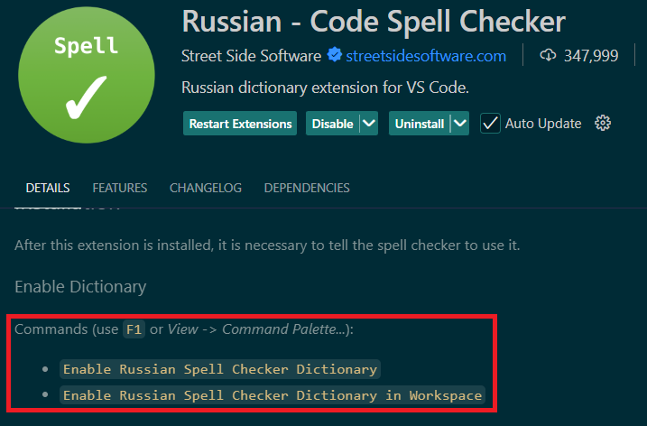

**Клонировать репозиторий** с заданиями, предварительно авторизовавшись на GitHub.

Для **программных** заданий клонируйте репозиторий [code-tasks](https://github.com/hse-algo-ps-25-2/code-tasks): в нём дальше создаёте `.venv` и ставите зависимости.

Для **ручных** заданий клонируйте репозиторий [manual-tasks](https://github.com/hse-algo-ps-25-2/manual-tasks): виртуальное окружение Python для них не нужно.

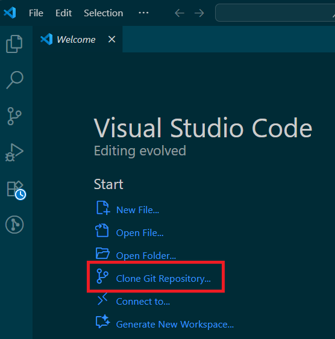

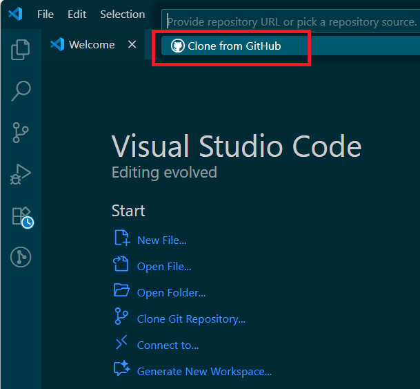

После авторизации репозитории организации будут доступны для выбора и клонирования

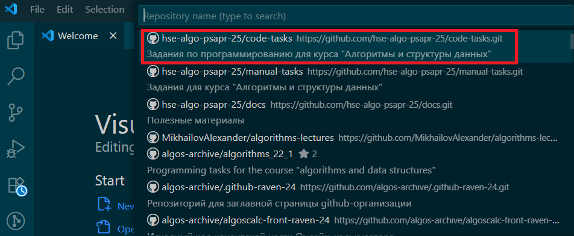

**Настроить виртуальное окружение для Python** в клонированном репозитории **code-tasks**. Это важный пункт: так вы изолируете репозиторий с программными заданиями от других своих проектов на Python и избежите конфликтов различных версий библиотек. В `manual-tasks` этот шаг пропускают.

Для создания среды нужно запустить в VS Code терминал, на Windows можно запустить Command Prompt

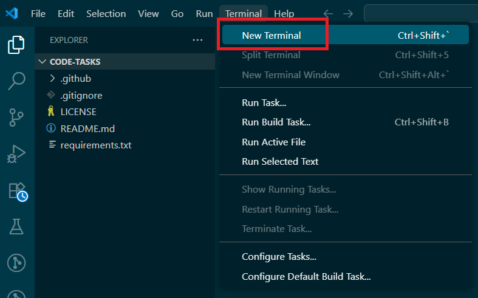

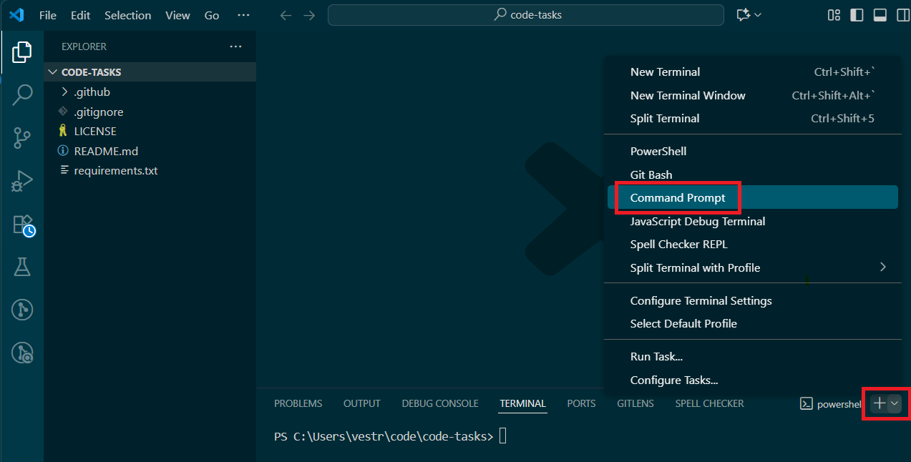

Выполнить в терминале команды (для Windows):
- `py -3.14 -m venv .venv` для создания каталога `.venv` с виртуальным окружением проекта
- `.venv\Scripts\activate.bat` - для активации окружения

В командной строке должен появиться префикс `(.venv)`, указывающий на то, что вы находитесь в виртуальном окружении. Это означает, что все команды, связанные с Python и pip, будут выполняться в контексте этого окружения.

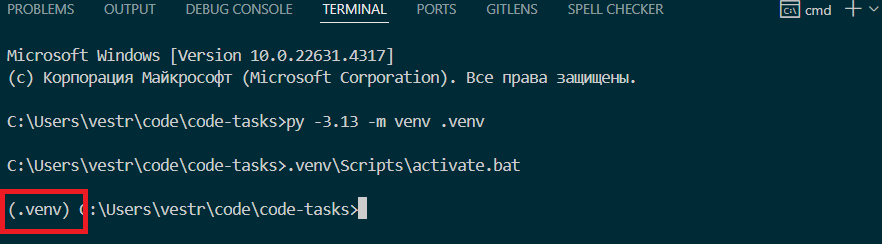

После создания виртуальной среды IDE предложит использовать ее по умолчанию, нужно подтвердить.

Вручную задать интерпретатор виртуальной среды можно через выбор команды F1 -> Select Interpreter

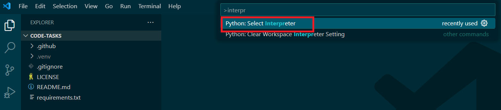

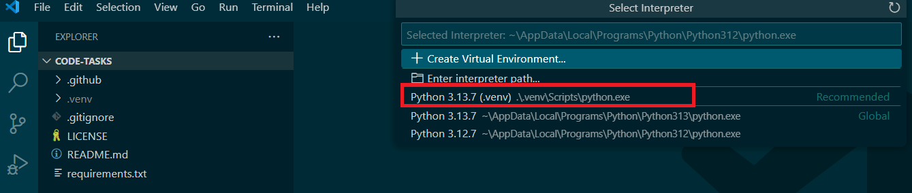

Проверьте, если в редакторе открыт файл Python, то в правом нижнем углу редактора должен быть выбран интерпретатор Python из виртуального окружения:

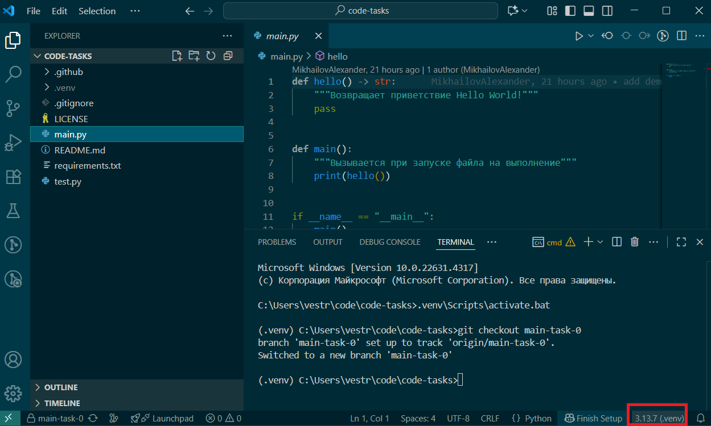

Далее необходимо установить зависимости проекта из файла `requirements.txt`. Команду `pip install -r requirements.txt` выполняйте **только** в терминале, где в приглашении есть префикс `(.venv)`. Если открыли новое окно терминала — сначала снова активируйте окружение, иначе пакеты попадут не в проект, а в системный Python.

## Если не Windows

Скриншоты и команды выше — для Windows. На macOS и Linux поставьте Git и Python 3.14 средствами системы (на Ubuntu, например, пакет `python3.14` из PPA [deadsnakes](https://launchpad.net/~deadsnakes/+archive/ubuntu/ppa)), проверьте версию командой `python3.14 --version`, клонируйте те же репозитории. Окружение в `code-tasks`: `python3.14 -m venv .venv`, активация — `source .venv/bin/activate`. Дальше так же: префикс `(.venv)` и `pip install -r requirements.txt`. VS Code и набор расширений совпадают.
